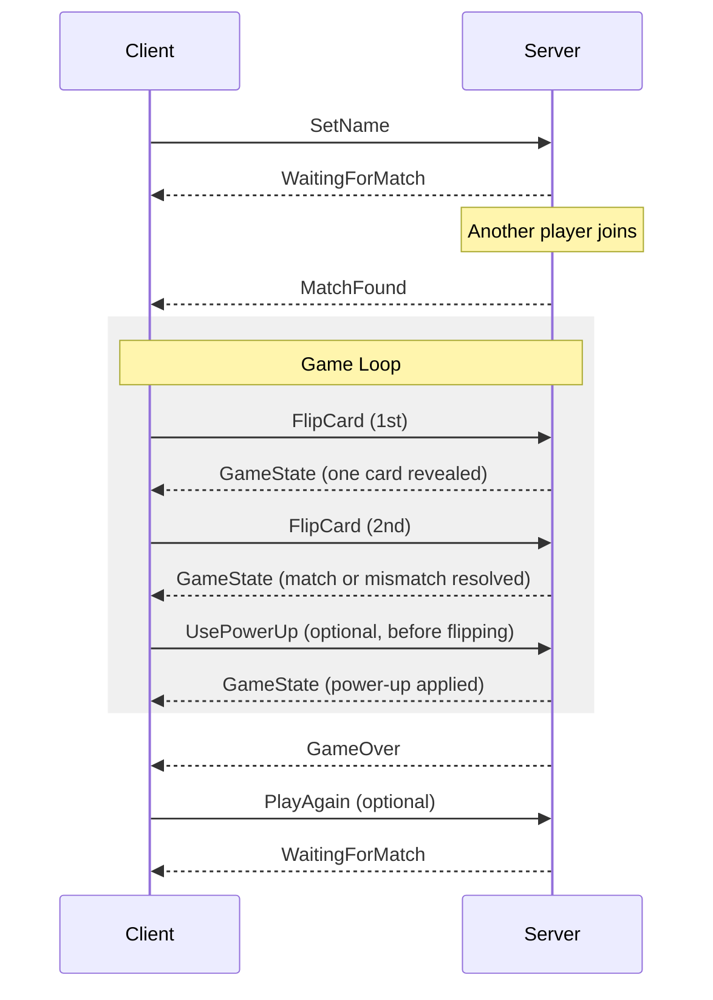

# Memory Game -- Global Specification

This document is the single source of truth for the competitive online memory card game. Both the server and the client implementations must conform to everything described here.

---

## 1. Game Overview

Two players are matched online and compete on a shared board of face-down cards. Players take turns flipping two cards per turn. If the two cards match, the player scores points and the cards remain face-up. If they do not match, both cards are flipped back face-down and the turn passes to the opponent. The game ends when all pairs have been found. The player with the highest score wins.

---

## 2. Session Identity

- There are no persistent user accounts, logins, or profiles.
- When a player connects, they choose a **display name** for the current session.
- The display name is used only for in-game identification and is discarded when the session ends.
- Display names must be between 1 and 24 characters.

---

## 3. Matchmaking

- After choosing a name, a player enters a **matchmaking queue**.
- The server pairs two queued players at random to start a new game.
- Multiple independent games may run simultaneously; each game is fully isolated.
- If no opponent is available, the player waits until one connects.
- If a player disconnects while waiting, they are silently removed from the queue.

---

## 4. Game Rules

### 4.1 Board Setup

- The board is a grid of cards arranged in `BOARD_ROWS x BOARD_COLS` cells.
- Each card belongs to exactly one pair (there are `(BOARD_ROWS * BOARD_COLS) / 2` distinct pairs).
- Card positions are randomized by the server at the start of the game.
- Each card has:
  - A unique positional **index** (0-based).
  - A **pairId** that identifies which pair it belongs to.
  - A **state**: `hidden`, `revealed`, or `matched`.

### 4.2 Turns

1. The server randomly selects which player goes first.
2. On their turn, the active player flips two cards by sending their indices to the server one at a time.
3. After the first card is flipped, the server broadcasts the updated state (that card is now `revealed`) to both players.
4. After the second card is flipped:
   - If the two revealed cards share the same `pairId`, they become `matched` and remain face-up. The active player scores points (see Section 5). **The active player keeps the turn.**
   - If the two revealed cards do not match, both are set back to `hidden` after a brief reveal window (`REVEAL_DURATION_MS`). The turn passes to the opponent.
5. A player may only flip cards that are currently `hidden`.

### 4.3 Game End

- The game ends when every card on the board is `matched`.
- The server sends a final `GameOver` message with the result (`win`, `lose`, or `draw`) and final scores.
- After the game, each player may choose to re-enter the matchmaking queue.

### 4.4 Disconnections

- If a player disconnects during a game, the opponent is notified and wins by default.
- The abandoned game is cleaned up on the server.

---

## 5. Scoring and Combo System

### 5.1 Base Scoring

Each matched pair awards points based on the player's current **combo streak**.

### 5.2 Combo Streak

- A player's combo streak starts at `0`.
- When a player matches a pair, the combo streak increments by `1`, and the player earns `COMBO_BASE_POINTS * combo_streak` points for that match.
- When a player fails to match (turn ends), the combo streak resets to `0`.
- The combo streak is per-player and is tracked independently.

**Example** (with `COMBO_BASE_POINTS = 1`):

| Match # (consecutive) | Combo Streak | Points Earned | Running Total |
|------------------------|--------------|---------------|---------------|
| 1st                    | 1            | 1             | 1             |
| 2nd                    | 2            | 2             | 3             |
| 3rd                    | 3            | 3             | 6             |
| Miss                   | reset to 0   | 0             | 6             |
| 1st (new streak)       | 1            | 1             | 7             |

---

## 6. Power-Up System

### 6.1 Overview

Power-ups are special actions a player can purchase by spending their accumulated points. The system is designed to be **extensible**: new power-ups can be added without modifying existing game logic.

### 6.2 Power-Up Contract

Every power-up has:

| Field         | Type     | Description                                        |
|---------------|----------|----------------------------------------------------|
| `id`          | `string` | Unique identifier (e.g., `"shuffle"`).             |
| `name`        | `string` | Human-readable name.                               |
| `description` | `string` | Brief explanation of the effect.                   |
| `cost`        | `int`    | Point cost to activate. Deducted from the player's score. |

A player may use a power-up **only during their own turn** and **before flipping any card** in that turn. Using a power-up does **not** end the turn.

A player's score cannot go below zero; a power-up can only be used if the player has enough points.

### 6.3 Initial Power-Up: Shuffle

| Field         | Value                                                         |
|---------------|---------------------------------------------------------------|
| `id`          | `"shuffle"`                                                   |
| `name`        | `Shuffle`                                                     |
| `description` | `Reshuffles the positions of all cards that are not yet matched.` |
| `cost`        | `POWERUP_SHUFFLE_COST` (configurable, default `3`)            |

**Effect**: All cards with state `hidden` have their positions randomly reassigned by the server. Cards that are already `matched` remain in place. Both players see the new layout.

### 6.4 Adding New Power-Ups

- **Server**: implement the `PowerUp` interface (see server plan) and register it in the power-up registry.
- **Client**: add a visual entry (icon, label, description) in the client-side power-up registry keyed by the power-up `id`.

---

## 7. Communication Protocol

### 7.1 Transport

- **WebSocket** over a single persistent connection per player.
- All messages are **JSON-encoded** UTF-8 text frames.
- Every message has a top-level `type` field that determines its schema.

### 7.2 Message Direction Convention

- **Client -> Server**: player actions.
- **Server -> Client**: state updates and notifications.

### 7.3 Client-to-Server Messages

#### `SetName`

Sent once after connecting to declare the player's display name.

```json
{
  "type": "set_name",
  "name": "<string, 1-24 chars>"
}
```

#### `FlipCard`

Sent during the player's turn to flip a card.

```json
{
  "type": "flip_card",
  "index": "<int, 0-based card index>"
}
```

#### `UsePowerUp`

Sent during the player's turn, before any card is flipped, to activate a power-up.

```json
{
  "type": "use_power_up",
  "powerUpId": "<string, e.g. 'shuffle'>"
}
```

#### `PlayAgain`

Sent after a game ends to re-enter the matchmaking queue.

```json
{
  "type": "play_again"
}
```

### 7.4 Server-to-Client Messages

#### `Error`

Sent when a client action is invalid.

```json
{
  "type": "error",
  "message": "<string, human-readable error description>"
}
```

#### `WaitingForMatch`

Confirms the player is in the matchmaking queue.

```json
{
  "type": "waiting_for_match"
}
```

#### `MatchFound`

Sent to both players when a match is made.

```json
{
  "type": "match_found",
  "opponentName": "<string>",
  "boardRows": "<int>",
  "boardCols": "<int>",
  "yourTurn": "<bool>"
}
```

#### `GameState`

Broadcast to both players after every state-changing event (card flip, power-up use). This is the **primary update mechanism**.

```json
{
  "type": "game_state",
  "cards": [
    {
      "index": "<int>",
      "pairId": "<int, only present if state != 'hidden'>",
      "state": "<'hidden' | 'revealed' | 'matched'>"
    }
  ],
  "you": {
    "name": "<string>",
    "score": "<int>",
    "comboStreak": "<int>"
  },
  "opponent": {
    "name": "<string>",
    "score": "<int>",
    "comboStreak": "<int>"
  },
  "yourTurn": "<bool>",
  "availablePowerUps": [
    {
      "id": "<string>",
      "name": "<string>",
      "description": "<string>",
      "cost": "<int>",
      "canAfford": "<bool>"
    }
  ],
  "flippedIndices": ["<int, indices of currently revealed (not yet resolved) cards>"],
  "phase": "<'first_flip' | 'second_flip' | 'resolve'>"
}
```

**Note on `pairId` visibility**: `pairId` is only sent for cards whose state is `revealed` or `matched`. For `hidden` cards, `pairId` is omitted to prevent client-side cheating.

#### `GameOver`

Sent when all pairs are matched.

```json
{
  "type": "game_over",
  "result": "<'win' | 'lose' | 'draw'>",
  "you": {
    "name": "<string>",
    "score": "<int>"
  },
  "opponent": {
    "name": "<string>",
    "score": "<int>"
  }
}
```

#### `OpponentDisconnected`

Sent if the opponent leaves mid-game.

```json
{
  "type": "opponent_disconnected"
}
```

### 7.5 Message Flow Diagram



---

## 8. Game State Model

The server maintains the following canonical state for each game:

```
Game {
  id:             string            // Unique game identifier
  phase:          GamePhase          // waiting | playing | finished
  board: {
    rows:         int
    cols:         int
    cards:        Card[]             // length = rows * cols
  }
  players:        [Player, Player]   // exactly two
  currentTurn:    int                // index into players (0 or 1)
  turnPhase:      TurnPhase          // first_flip | second_flip | resolve
  flippedIndices: int[]              // indices of cards flipped this turn (0, 1, or 2)
}

Card {
  index:          int                // positional index on the board
  pairId:         int                // which pair this card belongs to
  state:          CardState          // hidden | revealed | matched
}

Player {
  name:           string
  score:          int
  comboStreak:    int
}
```

**Important**: the server is the sole owner of game state. The client never computes or stores game logic -- it only renders what the server sends.

---

## 9. Configuration Parameters

All of the following values must be configurable (e.g., via config file, environment variables, or constants). Default values are provided.

| Parameter               | Type  | Default | Description                                                  |
|--------------------------|-------|---------|--------------------------------------------------------------|
| `BOARD_ROWS`             | int   | `4`     | Number of rows on the board.                                 |
| `BOARD_COLS`             | int   | `4`     | Number of columns on the board. `ROWS * COLS` must be even.  |
| `COMBO_BASE_POINTS`      | int   | `1`     | Points multiplier per combo level.                           |
| `REVEAL_DURATION_MS`     | int   | `1000`  | How long mismatched cards stay revealed before hiding (ms).  |
| `POWERUP_SHUFFLE_COST`   | int   | `3`     | Point cost of the Shuffle power-up.                          |
| `MAX_NAME_LENGTH`        | int   | `24`    | Maximum characters for a player display name.                |
| `WS_PORT`                | int   | `8080`  | Port the WebSocket server listens on.                        |
| `MAX_LATENCY_MS`         | int   | `500`   | Acceptable one-way latency budget (for reference/monitoring).|

---

## 10. Extensibility Principles

1. **Power-ups are data-driven**: each power-up is a self-contained unit with an ID, cost, and effect. No switch/case on type -- use a registry/map pattern.
2. **Server is client-agnostic**: the protocol is plain JSON over WebSocket. Any client (web, mobile, CLI) can implement it.
3. **No client-side game logic**: the client is a thin renderer. All validation, state transitions, and rule enforcement happen on the server.
4. **Parametric tuning**: every gameplay-affecting constant is a configurable parameter, not a hard-coded literal.
