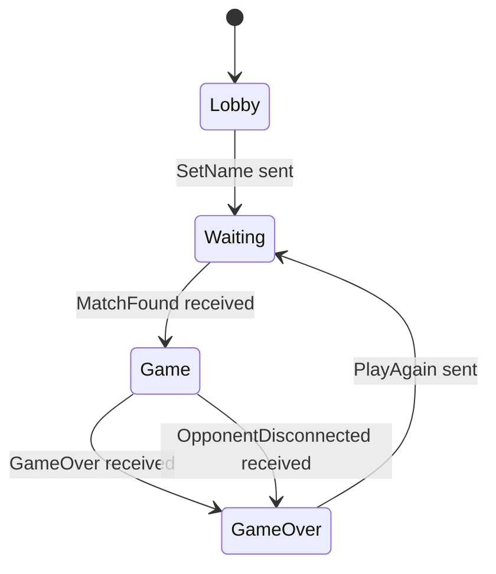

# Client Implementation Plan

This document describes the architecture and implementation plan for the web client, built with **React** and **TypeScript**. It conforms to the global specification defined in [`../SPEC.md`](../SPEC.md).

---

## 1. Tech Stack

| Component       | Choice                  | Rationale                                                   |
|-----------------|-------------------------|-------------------------------------------------------------|
| Framework       | React 18+               | Component-based UI, wide ecosystem.                         |
| Language        | TypeScript              | Type safety, better DX, self-documenting interfaces.        |
| Build Tool      | Vite                    | Fast HMR, minimal config.                                   |
| Package Manager | pnpm                    | Fast, disk-efficient.                                       |
| Styling         | CSS Modules             | Scoped styles, zero runtime, works out of the box with Vite.|

---

## 2. Core Principle

**The client contains zero game logic.** It is a pure renderer of server state. All validation, rule enforcement, scoring, and state transitions happen on the server. The client:

- Sends user actions (name, card clicks, power-up activations) to the server.
- Receives `GameState` snapshots from the server.
- Renders whatever the server tells it to render.

---

## 3. Project Structure

```
client/
  index.html
  package.json
  tsconfig.json
  vite.config.ts
  src/
    main.tsx                       # React root mount
    App.tsx                        # Top-level component, screen router
    types/
      messages.ts                  # TypeScript types for all WS messages (mirrors SPEC)
      game.ts                      # GameState, Card, Player, PowerUp types
    hooks/
      useGameSocket.ts             # WebSocket lifecycle, message send/receive
    screens/
      LobbyScreen.tsx              # Name input + "Find Match"
      WaitingScreen.tsx            # Matchmaking spinner
      GameScreen.tsx               # Main game view (board, scores, power-ups)
      GameOverScreen.tsx           # Result display + "Play Again"
    components/
      Board.tsx                    # Grid of Card components
      Card.tsx                     # Single card (flip animation, states)
      ScorePanel.tsx               # Player + opponent scores, combo streak
      PowerUpShop.tsx              # List of purchasable power-ups
      TurnIndicator.tsx            # Whose turn it is
      ComboIndicator.tsx           # Visual combo streak feedback
    powerups/
      registry.ts                  # Power-up display metadata registry
    styles/
      global.module.css            # Global resets and variables
      LobbyScreen.module.css
      WaitingScreen.module.css
      GameScreen.module.css
      GameOverScreen.module.css
      Board.module.css
      Card.module.css
      ScorePanel.module.css
      PowerUpShop.module.css
```

---

## 4. Type Definitions

### 4.1 Game State (`types/game.ts`)

These types mirror the server's `GameState` message exactly:

```typescript
type CardState = "hidden" | "revealed" | "matched";

interface CardView {
  index: number;
  pairId?: number;   // only present when state !== "hidden"
  state: CardState;
}

interface PlayerView {
  name: string;
  score: number;
  comboStreak: number;
}

interface PowerUpView {
  id: string;
  name: string;
  description: string;
  cost: number;
  canAfford: boolean;
}

type TurnPhase = "first_flip" | "second_flip" | "resolve";

interface GameState {
  cards: CardView[];
  you: PlayerView;
  opponent: PlayerView;
  yourTurn: boolean;
  availablePowerUps: PowerUpView[];
  flippedIndices: number[];
  phase: TurnPhase;
}
```

### 4.2 Messages (`types/messages.ts`)

```typescript
// --- Client -> Server ---
interface SetNameMsg       { type: "set_name";     name: string; }
interface FlipCardMsg      { type: "flip_card";    index: number; }
interface UsePowerUpMsg    { type: "use_power_up"; powerUpId: string; }
interface PlayAgainMsg     { type: "play_again"; }

type ClientMessage = SetNameMsg | FlipCardMsg | UsePowerUpMsg | PlayAgainMsg;

// --- Server -> Client ---
interface ErrorMsg                { type: "error";                 message: string; }
interface WaitingForMatchMsg      { type: "waiting_for_match"; }
interface MatchFoundMsg           { type: "match_found";           opponentName: string; boardRows: number; boardCols: number; yourTurn: boolean; }
interface GameStateMsg            { type: "game_state";            /* ...GameState fields... */ }
interface GameOverMsg             { type: "game_over";             result: "win" | "lose" | "draw"; you: PlayerView; opponent: PlayerView; }
interface OpponentDisconnectedMsg { type: "opponent_disconnected"; }

type ServerMessage = ErrorMsg | WaitingForMatchMsg | MatchFoundMsg | GameStateMsg | GameOverMsg | OpponentDisconnectedMsg;
```

---

## 5. Screens and Navigation

The app has no client-side router (no URL-based routing). Navigation is driven entirely by the server message flow. The `App` component maintains a `screen` state that transitions based on received messages:



### 5.1 Lobby Screen

- Text input for display name (1-24 characters).
- "Find Match" button (disabled until name is valid).
- On submit: sends `SetName`, transitions to Waiting.

### 5.2 Waiting Screen

- Displays a loading animation and a message ("Looking for an opponent...").
- No user interaction needed; waits for `MatchFound`.

### 5.3 Game Screen

The main gameplay view. Composed of:

| Component         | Description                                                                                      |
|-------------------|--------------------------------------------------------------------------------------------------|
| `Board`           | `rows x cols` grid of `Card` components. Clicking a card sends `FlipCard`.                      |
| `Card`            | Renders based on `CardState`. CSS flip animation for `hidden -> revealed` transition.            |
| `ScorePanel`      | Shows both players' names, scores, and current combo streaks.                                    |
| `TurnIndicator`   | Clear visual cue for whose turn it is. Disables card clicks when it is not the player's turn.   |
| `PowerUpShop`     | Lists available power-ups. Each button shows name, cost, and is disabled if `canAfford` is false or it's not the player's turn or a card has already been flipped. Clicking sends `UsePowerUp`. |
| `ComboIndicator`  | Animated feedback when the combo streak increases (e.g., "x2!", "x3!").                         |

**Interaction rules (enforced visually but ultimately validated by the server):**
- Cards are only clickable when `yourTurn === true` and `phase !== "resolve"`.
- Power-ups are only clickable when `yourTurn === true` and `phase === "first_flip"`.

### 5.4 Game Over Screen

- Displays result ("You Win!", "You Lose!", "Draw!").
- Shows final scores for both players.
- "Play Again" button: sends `PlayAgain`, transitions to Waiting.

---

## 6. WebSocket Hook (`hooks/useGameSocket.ts`)

A custom React hook that encapsulates all WebSocket logic.

### Interface

```typescript
interface UseGameSocket {
  connected: boolean;
  send: (msg: ClientMessage) => void;
  lastMessage: ServerMessage | null;
}

function useGameSocket(url: string): UseGameSocket;
```

### Behavior

- Opens a WebSocket connection on mount.
- Exposes a `send` function to dispatch `ClientMessage` objects (serialized to JSON).
- Updates `lastMessage` on every incoming server message.
- Handles reconnection on unexpected disconnects (with exponential backoff, capped at 5 seconds).
- Cleans up the connection on unmount.

### Usage in `App.tsx`

```typescript
const { connected, send, lastMessage } = useGameSocket(WS_URL);

useEffect(() => {
  if (!lastMessage) return;
  switch (lastMessage.type) {
    case "waiting_for_match":
      setScreen("waiting");
      break;
    case "match_found":
      setMatchInfo(lastMessage);
      setScreen("game");
      break;
    case "game_state":
      setGameState(lastMessage);
      break;
    case "game_over":
      setGameResult(lastMessage);
      setScreen("gameover");
      break;
    case "opponent_disconnected":
      setScreen("gameover");
      break;
    case "error":
      showError(lastMessage.message);
      break;
  }
}, [lastMessage]);
```

---

## 7. State Management

No external state management library is needed. The app uses plain React state:

| State Variable | Type              | Set By                  |
|----------------|-------------------|-------------------------|
| `screen`       | `ScreenName`      | Message-driven transitions |
| `gameState`    | `GameState | null`| Updated on every `game_state` message |
| `matchInfo`    | `MatchFoundMsg | null` | Set on `match_found` |
| `gameResult`   | `GameOverMsg | null`   | Set on `game_over`  |

All of these live in `App.tsx` and are passed down as props. There is no need for context or global stores given the flat component hierarchy.

---

## 8. Power-Up Display Registry (`powerups/registry.ts`)

A static registry that maps power-up IDs to client-side display metadata:

```typescript
interface PowerUpDisplayInfo {
  icon: string;       // emoji or icon name
  label: string;
  description: string;
}

const POWER_UP_DISPLAY: Record<string, PowerUpDisplayInfo> = {
  shuffle: {
    icon: "🔀",
    label: "Shuffle",
    description: "Reshuffles all unmatched cards on the board.",
  },
};
```

To add a new power-up to the client, add an entry to this map. The `PowerUpShop` component uses this registry to render icons and labels alongside the dynamic data (`cost`, `canAfford`) from the server's `GameState`.

---

## 9. Animations

| Animation         | Trigger                                         | Implementation                                                                |
|-------------------|-------------------------------------------------|-------------------------------------------------------------------------------|
| Card flip         | Card state changes (`hidden` <-> `revealed`)    | CSS 3D transform (`rotateY`) with `transition`. Two faces (front/back).       |
| Card match        | Card state becomes `matched`                    | Brief scale pulse + glow effect via CSS `@keyframes`.                         |
| Combo streak      | `comboStreak` increases                         | Floating "+N" text animation near the score panel.                            |
| Shuffle           | All card positions change (detected via diff)   | Cards briefly fade out and fade back in at new positions.                     |
| Waiting spinner   | On Waiting screen                               | CSS `@keyframes` rotating animation.                                          |

All animations are purely cosmetic and do not block or delay user input. They are driven by diffing the previous and current `GameState`.

---

## 10. Responsive Design

- The board uses CSS Grid with `auto-fit` / `minmax` for fluid card sizing.
- On narrow screens (mobile), the score panel and power-up shop stack below the board.
- Minimum supported viewport: 360px wide.
- Cards maintain a square aspect ratio via `aspect-ratio: 1`.

---

## 11. Environment Configuration

A single environment variable for the WebSocket server URL:

```
VITE_WS_URL=ws://localhost:8080/ws
```

Accessed in code via `import.meta.env.VITE_WS_URL`.

---

## 12. Adding a New Power-Up (Client Checklist)

1. Add an entry to `powerups/registry.ts` with the new power-up's `id`, `icon`, `label`, and `description`.
2. If the power-up has a unique visual effect (e.g., a board animation), add the animation CSS and trigger it by detecting the relevant state change in `GameScreen`.
3. No changes needed to `useGameSocket`, `types/`, or any screen logic -- the `PowerUpShop` component automatically renders all power-ups present in the server's `availablePowerUps` array.
