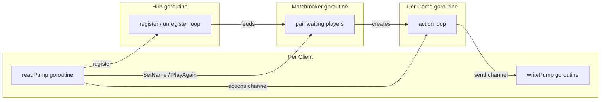

# Server Implementation Plan

This document describes the architecture and implementation plan for the game server, written in **Go**. It conforms to the global specification defined in [`../SPEC.md`](../SPEC.md).

---

## 1. Tech Stack

| Component        | Choice                          | Rationale                                                   |
|------------------|---------------------------------|-------------------------------------------------------------|
| Language         | Go 1.22+                        | Strong concurrency primitives, fast compilation, small binary.|
| WebSocket        | `github.com/gorilla/websocket`  | Mature, battle-tested WebSocket library for Go.             |
| Configuration    | JSON config file + env overrides| Simple, no extra dependencies. Env vars override file values.|
| Testing          | `testing` (stdlib)              | Standard Go testing; no external framework needed.          |

---

## 2. Package Layout

```
server/
  main.go                  # Entry point: loads config, starts HTTP/WS server
  config/
    config.go              # Config struct, loader (file + env), defaults
  ws/
    hub.go                 # Connection registry, message routing
    client.go              # Per-connection read/write goroutines, message pump
    message.go             # Inbound/outbound message type definitions (JSON structs)
  game/
    game.go                # Game struct, core state machine (FlipCard, resolve, turn logic)
    board.go               # Board generation, card shuffling
    player.go              # Player struct (name, score, combo)
    state.go               # Serializable GameState for broadcasting to clients
  matchmaking/
    matchmaker.go          # Thread-safe queue, pairing logic
  powerup/
    registry.go            # PowerUp interface, global registry map
    chaos.go               # Chaos power-up implementation
    clairvoyance.go        # Clairvoyance power-up (3x3 reveal)
    necromancy.go          # Necromancy power-up (return matched to board)
    unveiling.go         # Unveiling power-up (highlight unknown tiles, current turn only)
```

---

## 3. Core Abstractions

### 3.1 Configuration (`config/config.go`)

```go
type Config struct {
    BoardRows          int `json:"board_rows"`
    BoardCols          int `json:"board_cols"`
    ComboBasePoints    int `json:"combo_base_points"`
    RevealDurationMS   int `json:"reveal_duration_ms"`
    PowerUpShuffleCost int `json:"powerup_shuffle_cost"`
    MaxNameLength      int `json:"max_name_length"`
    WSPort             int `json:"ws_port"`
}
```

- Loaded at startup from an optional `config.json` file.
- Each field can be overridden by an environment variable (e.g., `BOARD_ROWS=6`).
- Sensible defaults are applied for any value not explicitly set (see SPEC Section 9).

### 3.2 WebSocket Hub (`ws/hub.go`)

The Hub is the central connection manager.

**Responsibilities:**
- Maintain a registry of all connected clients.
- Accept new WebSocket connections and create a `Client` for each.
- Route incoming messages from a `Client` to either the `Matchmaker` or the client's active `Game`.
- Remove clients on disconnect and notify the relevant game.

**Key fields:**

```go
type Hub struct {
    clients    map[*Client]bool
    register   chan *Client
    unregister chan *Client
    matchmaker *matchmaking.Matchmaker
}
```

Runs as a single long-lived goroutine processing `register` / `unregister` channels.

### 3.3 WebSocket Client (`ws/client.go`)

One `Client` per WebSocket connection.

**Responsibilities:**
- Run two goroutines: `readPump` (reads from WS, dispatches to Hub/Game) and `writePump` (sends queued messages to WS).
- Hold a reference to the player's current `Game` (nil if not in a game).
- Buffer outbound messages in a channel.

```go
type Client struct {
    hub      *Hub
    conn     *websocket.Conn
    send     chan []byte
    name     string
    game     *game.Game
    playerID int  // 0 or 1 within the game
}
```

### 3.4 Messages (`ws/message.go`)

All messages are strongly typed Go structs with JSON tags. A generic envelope is used for deserialization routing:

```go
type InboundEnvelope struct {
    Type string          `json:"type"`
    Raw  json.RawMessage `json:"-"` // remaining payload
}
```

Inbound message types:
- `SetNameMsg`    -> `{ "type": "set_name", "name": "..." }`
- `FlipCardMsg`   -> `{ "type": "flip_card", "index": N }`
- `UsePowerUpMsg` -> `{ "type": "use_power_up", "powerUpId": "..." }`
- `PlayAgainMsg`  -> `{ "type": "play_again" }`

Outbound message types mirror the server-to-client messages in the spec: `ErrorMsg`, `WaitingForMatchMsg`, `MatchFoundMsg`, `GameStateMsg`, `GameOverMsg`, `OpponentDisconnectedMsg`.

### 3.5 Game (`game/game.go`)

The `Game` is the heart of the server. Each instance manages one match between two players.

**Key fields:**

```go
type Game struct {
    id             string
    board          *Board
    players        [2]*Player
    currentTurn    int        // 0 or 1
    turnPhase      TurnPhase  // FirstFlip, SecondFlip, Resolve
    flippedIndices []int
    config         *config.Config
    powerUpRegistry *powerup.Registry

    actions chan Action   // channel for serialized access
    done    chan struct{} // closed when game ends
}
```

**Concurrency model:** Each `Game` runs its own goroutine (`Run()`) that listens on the `actions` channel. This serializes all mutations -- no mutexes needed inside the game. Both players' `Client.readPump` send actions into this channel.

**Methods / action handlers:**

| Action        | Handler Logic                                                                                                                                                   |
|---------------|-----------------------------------------------------------------------------------------------------------------------------------------------------------------|
| `FlipCard`    | Validate (correct turn, card is hidden, turn phase). Set card to `revealed`. If second flip: check pair match, update score/combo, advance turn or keep turn.   |
| `UsePowerUp`  | Validate (correct turn, phase is `FirstFlip`, player can afford). Look up power-up in registry, call `Apply()`, deduct cost.                                    |
| `Disconnect`  | Mark opponent as winner, broadcast `OpponentDisconnected`, close game.                                                                                          |

After each action, the game builds a per-player `GameState` snapshot and sends it to each player via their `Client.send` channel.

### 3.6 Board (`game/board.go`)

```go
type Board struct {
    Rows  int
    Cols  int
    Cards []Card
}

type Card struct {
    Index  int
    PairID int
    State  CardState // Hidden, Revealed, Matched
}
```

**Functions:**
- `NewBoard(rows, cols int) *Board` -- creates a board with randomly shuffled pairs.
- `ShuffleUnmatched(board *Board)` -- re-randomizes positions of all `Hidden` cards (used by Chaos and Necromancy power-ups).

### 3.7 Player (`game/player.go`)

```go
type Player struct {
    Name        string
    Score       int
    ComboStreak int
    Send        chan []byte  // reference to Client.send
}
```

### 3.8 Matchmaker (`matchmaking/matchmaker.go`)

**Responsibilities:**
- Maintain a thread-safe queue of players waiting for a match.
- When two players are in the queue, pair them, create a new `Game`, and notify both.

```go
type Matchmaker struct {
    queue chan *ws.Client
    config *config.Config
    powerUpRegistry *powerup.Registry
}
```

Runs as a goroutine: blocks reading two clients from the queue, creates a `Game`, starts its `Run()` goroutine, and sends `MatchFound` to both clients.

### 3.9 Power-Up Interface (`powerup/registry.go`)

```go
type PowerUp interface {
    ID() string
    Name() string
    Description() string
    Cost() int
    Apply(ctx *GameContext) error
}

type GameContext struct {
    Board          *game.Board
    ActivePlayer   *game.Player
    OpponentPlayer *game.Player
}

type Registry struct {
    powerUps map[string]PowerUp
}

func (r *Registry) Register(p PowerUp)          { r.powerUps[p.ID()] = p }
func (r *Registry) Get(id string) (PowerUp, bool) { ... }
func (r *Registry) All() []PowerUp              { ... }
```

### 3.10 Chaos Power-Up (`powerup/chaos.go`)

Reshuffles all unmatched cards. When applied, the game layer clears `KnownIndices` and `HighlightIndices` for both players.

### 3.11 Clairvoyance, Necromancy, Unveiling

- **Clairvoyance**: Reveals a 3×3 region around a chosen card for a short duration, then hides again (same behavior as former Radar).
- **Necromancy**: Returns all matched tiles to the board as hidden and shuffles their positions.
- **Unveiling**: Highlights tiles that have never been revealed; effect lasts only the current turn. Server tracks `KnownIndices`; cleared when Chaos is used.

---

## 4. Concurrency Architecture



**Goroutine summary:**
- 1 Hub goroutine (lifetime of the server).
- 1 Matchmaker goroutine (lifetime of the server).
- 2 goroutines per connected client (`readPump` + `writePump`).
- 1 goroutine per active game (`Game.Run()`).

---

## 5. Request Lifecycle

1. **Connect**: HTTP upgrade to WebSocket. Hub creates a `Client`, registers it.
2. **SetName**: Client sends `set_name`. Hub validates length, stores name on `Client`.
3. **Queue**: Client is pushed into the Matchmaker queue. Server sends `WaitingForMatch`.
4. **MatchFound**: Matchmaker pops two clients, creates a `Game`, starts its goroutine. Both clients receive `MatchFound`.
5. **Game loop**: `FlipCard` and `UsePowerUp` messages flow into the game's action channel. After each action, `GameState` is broadcast to both players.
6. **Game over**: When all pairs matched, `GameOver` is sent. Game goroutine exits.
7. **Play again**: Client sends `play_again`, re-enters the matchmaker queue.
8. **Disconnect**: `readPump` detects closed connection, notifies Hub (unregister) and Game (disconnect action).

---

## 6. State Broadcasting

After every state mutation, the game produces a **per-player view** of the state:

- For the active player: `yourTurn = true`.
- For the opponent: `yourTurn = false`.
- `pairId` is included only for cards with state `revealed` or `matched` (never for `hidden`).
- `availablePowerUps` includes a `canAfford` flag computed from the player's current score.

This ensures the client cannot cheat and receives only the information it is allowed to see.

---

## 7. Error Handling

Invalid client actions receive an `Error` message and are otherwise ignored. Examples:
- Flipping a card when it is not the player's turn.
- Flipping an already matched or revealed card.
- Using a power-up the player cannot afford.
- Using a power-up during `SecondFlip` or `Resolve` phase.
- Sending `flip_card` with an out-of-bounds index.

The game state is never corrupted by invalid input.

---

## 8. Testing Strategy

- **Unit tests** for `game` package: test `FlipCard`, combo scoring, power-up application, turn transitions, and edge cases (double-flip same card, out-of-bounds, etc.).
- **Unit tests** for `matchmaking`: test pairing logic, queue operations.
- **Integration tests**: spin up a server, connect two WebSocket clients, play a full game programmatically, and assert on the messages received.

---

## 9. Entry Point (`main.go`)

```go
func main() {
    cfg := config.Load()

    registry := powerup.NewRegistry()
    registry.Register(&powerup.ChaosPowerUp{CostValue: 0})
    registry.Register(&powerup.ClairvoyancePowerUp{CostValue: 0, RevealDuration: ...})
    registry.Register(&powerup.NecromancyPowerUp{CostValue: 0})
    registry.Register(&powerup.UnveilingPowerUp{CostValue: 0})

    mm := matchmaking.NewMatchmaker(cfg, registry)
    go mm.Run()

    hub := ws.NewHub(mm)
    go hub.Run()

    http.HandleFunc("/ws", func(w http.ResponseWriter, r *http.Request) {
        hub.ServeWS(w, r)
    })

    addr := fmt.Sprintf(":%d", cfg.WSPort)
    log.Printf("Server listening on %s", addr)
    log.Fatal(http.ListenAndServe(addr, nil))
}
```

---

## 10. Adding a New Power-Up (Checklist)

1. Create a new file in `powerup/` (e.g., `powerup/freeze.go`).
2. Implement the `PowerUp` interface (`ID`, `Name`, `Description`, `Cost`, `Apply`).
3. Add a config field for the cost in `config/config.go`.
4. Register it in `main.go`: `registry.Register(&powerup.FreezePowerUp{Cost: cfg.PowerUpFreezeCost})`.
5. No changes needed to `game/`, `ws/`, or `matchmaking/` packages.
